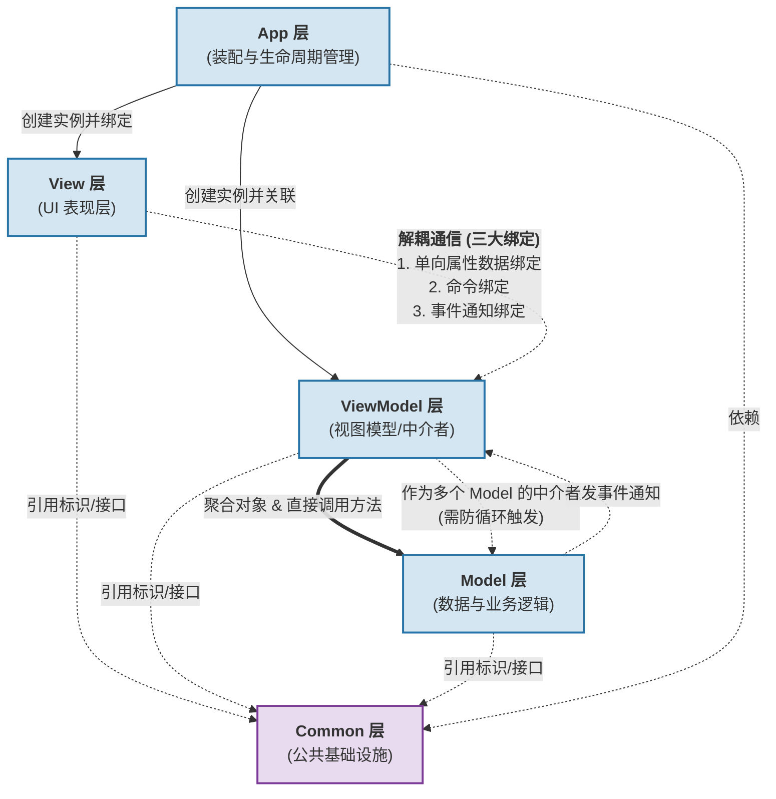

### 一、 MVVM 架构层级关系图 (Mermaid)

该图表展示了 PPT 中定义的五个核心层级（App, View, ViewModel, Model, Common）之间的依赖、绑定和调用关系。

---

### 二、 MVVM 架构各层级详细说明 (Markdown)

基于 PPT 内容，整个项目在源代码树下被划分为 5 个子目录（`app`, `view`, `viewmodel`, `model`, `common`），对应 5 个逻辑层。

#### 1. Common 层 (公共基础层)
*   **目录**: `common` 子目录
*   **职责**: 存放整个架构中各个层都需要共用的基础组件、接口和标识符。
*   **具体内容**: 
    *   **通知触发类**: 用于实现事件通知机制的基础类。
    *   **属性标识**: 用于数据绑定时的统一标识符。
    *   **命令接口**: 如 `ICommandBase`, `ICommandParameter` 等定义。
*   **工程意义**: 消除各个高层模块之间的直接交叉引用，统一数据和事件的契约。由专门的同学负责维护。

#### 2. Model 层 (数据模型层)
*   **目录**: `model` 子目录
*   **职责**: 负责核心的业务逻辑和原始数据的维护。
*   **交互方式**:
    *   被动被调用：暴露出方法供 ViewModel 直接调用。
    *   主动发通知：当自身数据状态发生变化时，**触发事件（Event）**向外广播，但不关心谁接收（通常是 ViewModel 接收）。

#### 3. ViewModel 层 (视图模型层 / 核心中枢)
*   **目录**: `viewmodel` 子目录
*   **职责**: 作为 View 层和 Model 层之间的桥梁和中介者，是 MVVM 模式的核心。
*   **核心特性与交互**:
    *   **替代 Controller**: 它本质上是改进后的表现层逻辑控制。
    *   **向下聚合 Model**: ViewModel 内部聚合（持有）Model 类的对象，可以**直接调用** Model 的方法来修改数据。
    *   **接收 Model 事件**: 充当 Model 事件的接收器。
    *   **数据转换**: ViewModel 持有的数据必须是**“可绘制对象”（适合 View 显示的数据）**。如果 Model 的原始数据类型与显示要求不一致，ViewModel 必须在其事件接收器内完成**数据类型的转换**。
    *   **超级中介者**: ViewModel 不仅协调 View 和 Model，还可以作为**多个 Model 类之间的中介者**（在一个 Model 的事件接收逻辑中调用另一个 Model 的方法，但需警惕死循环）。
*   **注意**: PPT 特别强调，QT 提供的 `ProxyModel` 虽然用于重新组织显示数据，但依然与 View 紧密耦合，**不是真正意义上的 ViewModel**。

#### 4. View 层 (视图/表现层)
*   **目录**: `view` 子目录
*   **职责**: 纯粹负责界面的展示和用户输入的捕获。
*   **解耦机制 (极其重要)**: View 层和 ViewModel、Model 层**彻底解开耦合**。View 不知道对方的实现细节。
*   **通信方式**: View 与 ViewModel 之间完全通过**“三个绑定”**来通信，而非直接方法调用：
    1.  **单向属性数据绑定**: 将 UI 控件的属性绑定到 ViewModel 的数据属性上。
    2.  **命令绑定 (Command)**: 将 UI 的操作（如点击按钮）绑定到 ViewModel 的具体命令上。
    3.  **事件通知绑定**: 监听 ViewModel 状态变化的通知以更新 UI。

#### 5. App 层 (装配层)
*   **目录**: `app` 子目录
*   **职责**: 充当程序的入口和依赖注入容器（Dependency Injection）。
*   **具体内容**: 提供 `App` 类，负责在程序启动时：
    1.  创建 View 层的实例。
    2.  创建 ViewModel/Model 层的实例。
    3.  将它们**绑定（装配）在一起**。
*   **工程意义**: 将对象的创建与对象的使用分离。通常由负责 Common 层的同学一并完成。
