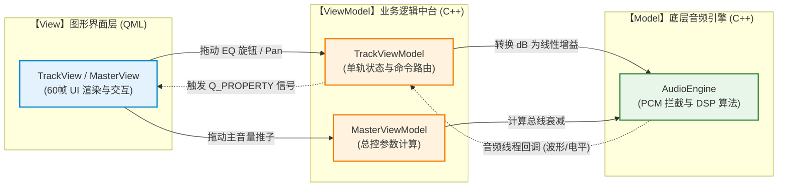
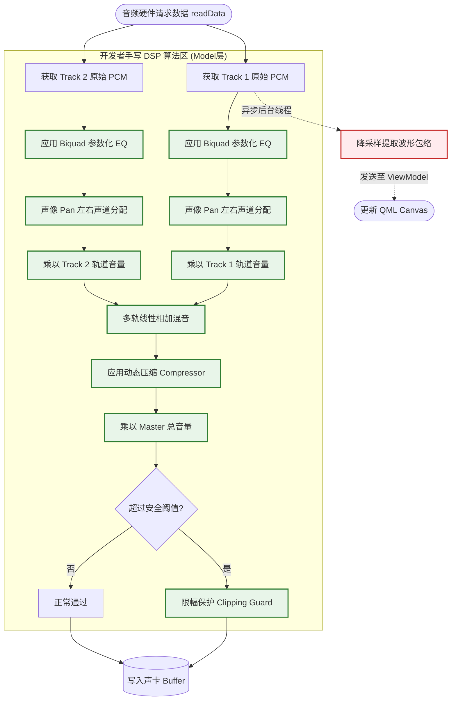
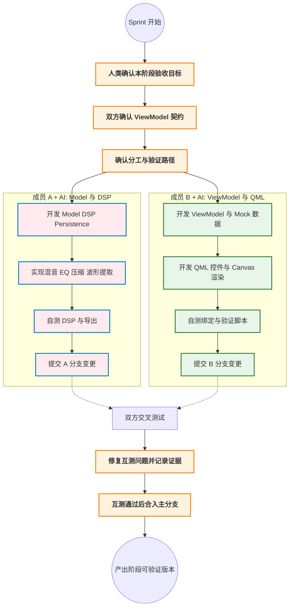

# C++ 调音室 (Mixing Studio) 项目规划与架构蓝图

**基于严格 MVVM 架构与 AI 主导协作的高完成度多轨调音工作台**

## 一、 项目概述与架构驱动策略

本项目旨在利用 Modern C++ (C++17) 与 Qt 6 构建一个面向课程设计、项目报告和可持续扩展的本地音频混合与处理软件——**调音室 (Mixing Studio)**。由于项目开发将以 AI 为主要协作力量，人类成员主要负责需求裁剪、关键决策、验收测试、版本管理和报告撰写，因此项目目标定位为“结构完整、功能饱满、工程严谨、报告可信”的多轨调音工作台。项目最终提交截止时间为 **7 月 18 日**。

项目不追求复刻完整商业 DAW，但必须体现一个调音软件应具备的完整闭环：素材导入、多轨编排、播放控制、实时调音、基础 DSP、视觉分析、工程保存、混音导出、质量验证和架构说明。项目从立项第一天起将 MVVM (Model-View-ViewModel) 作为不可妥协的架构约束，所有 UI 操作必须经过 ViewModel，所有音频处理必须沉淀在 Model/DSP 层。

项目的核心挑战在于：在多轨音量、静音/独奏、声像、EQ、压缩/限幅、波形与电平反馈等交互中，如何通过 ViewModel 的状态路由，稳定、安全地驱动底层 C++ Model 与 DSP 逻辑，并实现低延迟、无明显爆音、可解释的听觉和视觉反馈。

**🌟 预期达成的核心目标：**
1.  **架构即规范 (MVVM-First)：** 强制实行 View 与 Model 的物理隔离。QML 仅负责渲染与事件捕获，C++ Model 仅负责 DSP 算法与数据持久化，ViewModel 承担所有状态转换与线程调度。
2.  **核心算法可解释：** 多轨混音、Pan 声像、三段 EQ、压缩/限幅、波形降采样、VU 电平计算等核心展示点优先手写；音频解码、文件选择、JSON/SQLite 等基础设施可合理使用 Qt 或成熟库。
3.  **AI 主导工程化：** 使用 AI 辅助生成骨架、补齐样板代码、编写测试、检查架构破坏点、整理报告材料；人类成员负责确认需求、运行验收、挑选验证路径和解释核心代码。
4.  **低风险并发与同步：** 将 UI 主线程、播放状态更新、分析数据计算分清边界；实时参数通过 ViewModel 统一收口，避免 QML 直接接触底层音频对象。
5.  **完整调音体验闭环：** 支持导入、素材库、播放控制、多轨混音、轨道控制、视觉反馈、工程保存、历史记录与 WAV 导出，保证最终报告中能用截图、提交记录、测试结果和运行说明完整证明。
6.  **大模型使用可追溯：** 项目报告必须保留大模型使用记录，包括使用阶段、采用模式、提示词摘要、AI 输出内容、人工修改与验收结论，避免只写“使用了 AI”而缺少证据。

---

## 二、 核心技术栈与功能蓝图 (34 项核心特性)

### 1. 项目功能模块全景导图

```mermaid
flowchart TD
    Root["C++ 调音室 Mixing Studio"]

    Root --> Model["Model 底层音频与算法"]
    Model --> ModelImport["本地音频导入与多轨加载"]
    Model --> ModelMix["Multi-Track 多轨线性混音"]
    Model --> ModelPan["Pan 声像与音量增益"]
    Model --> ModelEq["EQ 三段参数处理"]
    Model --> ModelDynamics["Compressor 与 Limiter 动态处理"]
    Model --> ModelWaveform["Envelope 波形降采样"]

    Root --> ViewModel["ViewModel 状态与控制中台"]
    ViewModel --> VmTrack["Track 轨道状态机"]
    ViewModel --> VmMaster["Master 总控路由"]
    ViewModel --> VmFx["FX Chain 音效链分发"]
    ViewModel --> VmThread["线程安全的数据转换"]

    Root --> View["View 高频交互与视觉反馈"]
    View --> ViewWaveform["Waveform 多轨波形对齐显示"]
    View --> ViewSpectrum["Spectrum 实时频域分析图"]
    View --> ViewVu["VU Meter 动态电平表"]
    View --> ViewControls["自定义旋钮与推子控件"]

    Root --> Persistence["持久化与素材管理"]
    Persistence --> ProjectJson["Project JSON 工程保存与加载"]
    Persistence --> SqliteIndex["SQLite 本地素材索引"]
    Persistence --> TagMetadata["Tag 元数据解析"]
    Persistence --> ExportWav["Export 混音结果导出 WAV"]
    Persistence --> RecentFiles["Recent 最近打开记录"]
    Persistence --> SearchAssets["Search 素材搜索过滤"]

    Root --> Quality["工程化与质量保证"]
    Quality --> CmakeBuild["CMake 跨平台构建"]
    Quality --> UnitTests["单元测试与验证样例"]
    Quality --> AsanLogs["ASAN 内存检测与日志"]
    Quality --> AiReview["AI Review 与架构检查"]
    Quality --> MockData["Mock 数据驱动开发"]
```

### 2. 核心功能特性拆解表

| 模块分类     | 核心功能点 (Features)                                        | MVVM 架构体现说明                                            |
| :----------- | :----------------------------------------------------------- | :----------------------------------------------------------- |
| **底层音频** | `01` 本地音频导入, `02` 多轨加载, **`03` 多轨同步播放**, **`04` 多轨线性混音**, `05` 主输出限幅, `06` WAV 混音导出 | **Model 层**：负责文件、播放、混音和输出能力；核心混音与限幅逻辑放在 DSP 模块，便于报告讲解。 |
| **播放控制** | `07` 播放, `08` 暂停, `09` 停止, `10` Seek 进度跳转, `11` 循环区间 Loop, `12` 主音量控制 | **ViewModel 层**：将按钮、进度条、Loop 区间和主控推子的 UI 操作转换为统一播放命令。 |
| **调音控制** | `13` 轨道音量推子, `14` 静音 Mute, `15` 独奏 Solo, `16` 声像 Pan, `17` 三段 EQ, `18` 压缩器 Compressor, `19` 音效旁路 Bypass | **ViewModel 层**：维护每条轨道的状态，统一处理 Solo/Mute 优先级、参数范围、FX 开关和变更通知。 |
| **视觉反馈** | `20` 轨道列表, `21` 基础波形显示, `22` 播放进度线, `23` VU 电平表, `24` 简易频谱显示, `25` 峰值/削波提示 | **View 层**：QML 只消费 ViewModel 暴露的轻量数组与属性，不直接读取音频文件或 DSP 对象。 |
| **素材与工程** | `26` SQLite 素材库, `27` 素材搜索过滤, `28` 最近打开记录, `29` 工程保存/加载(JSON), `30` 工程状态恢复 | **Model 层**：负责持久化与索引；ViewModel 负责把当前界面状态组织为可保存、可恢复的数据。 |
| **质量与报告** | `31` Mock 数据验证模式, `32` DSP 单元测试, `33` 架构边界检查清单, `34` 报告素材与样例工程 | **工程层**：AI 负责高频生成与检查，人类负责运行验收；最终报告用测试、提交记录和调用链证明完成度。 |

---

## 三、 核心架构设计与算法逻辑

### 1. 严格的 MVVM 桌面软件架构

本项目从 Day 1 起即采用此架构。QML 前端与 C++ 后端通过 ViewModel 进行强约束的契约式通信。

### 2. 底层音频处理核心算法流程图

体现“底层数据修改”的核心逻辑。7 月 18 日前的主线版本优先保证播放与验证稳定：解码可借助 Qt 能力，混音、限幅、波形降采样和电平计算作为主要手写 DSP 展示点。

---

## 四、 AI 主导协同与人机分工机制

项目采用 **“双人分别操控 AI + 分层主责 + 交叉测试 + 主分支保护 + 报告证据留存”** 的协同策略。两名成员都使用 AI 提升开发效率，但不是让同一个 AI 代理无边界地完成所有代码；成员 A 主责 Model/DSP/Persistence，成员 B 主责 ViewModel/View/Report。每个阶段双方必须互相测试对方实现，通过后才能合入主分支，并将过程证据沉淀到总报告和个人分报告中。

AI 主导并不意味着无约束堆功能。所有 AI 生成的代码必须通过 ViewModel 契约、目录边界、构建检查、对方交叉测试和人工试听验收，避免出现“功能很多但不可解释、不可运行、报告无法证明”的问题。

### 1. 人机角色定义与功能认领

*   **成员 A + AI：** 主责 `src/Model/`、`src/DSP/`、音频导入/混音/导出、SQLite/JSON 持久化和底层测试；不直接改 QML 业务逻辑。
*   **成员 B + AI：** 主责 `src/ViewModel/`、`src/View/`、`Q_PROPERTY`、状态机、QML 控件、报告结构和截图证据；不直接操作 PCM 字节流。
*   **成员 A 测试 B：** 检查 ViewModel/QML 是否符合接口、是否越过 Model、UI 状态是否能正确触发底层。
*   **成员 B 测试 A：** 检查 Model/DSP 是否按接口工作、音频参数是否生效、保存/导出/分析数据是否能被 ViewModel 消费。

### 2. AI 主导开发流 (Collaboration Flow)

---

## 五、 敏捷开发排期与迭代计划 (The 5 Sprints)

### 需求追踪矩阵 (Traceability Matrix)

| Sprint       | 核心目标                                | 成员 A + AI 主责模块                | 成员 B + AI 主责模块                    | 交付物/Tag      |
| :----------- | :-------------------------------------- | :-------------------------------- | :------------------------------------- | :-------------- |
| **Sprint 1** | **架构奠基：** 跑通 MVVM 骨架、Mock UI、构建系统 | Model/DSP 接口、CMake、测试骨架 | VM 契约、QML 主界面、Mock 数据 | `v0.1` (Architecture) |
| **Sprint 2** | **播放与导入闭环：** 本地素材、多轨、播放控制 | `01-12` 导入、多轨、同步、播放、Seek、Loop、主音量底层接口 | 轨道列表、播放控制区、进度条、主控绑定 | `v0.5` (Playback) |
| **Sprint 3** | **调音与 DSP 闭环：** 混音、Pan、EQ、压缩、限幅 | 音量、Pan、EQ、Compressor、Bypass 底层处理 | Mute、Solo、推子、旋钮、开关、状态机与参数回显 | `v1.0` (Mixing) |
| **Sprint 4** | **视觉分析与素材工程：** 波形、电平、频谱、素材库 | 波形、VU、频谱、削波提示、SQLite、JSON 工程保存/加载 | Canvas/控件渲染、素材搜索 UI、最近记录、工程入口 | `v1.5` (Studio) |
| **Sprint 5** | **质量封版：** 7 月 17 日冻结，7 月 18 日提交 | WAV 导出验收、DSP 测试、底层架构清单、A 的分报告 | Mock 验证模式、样例工程、报告截图、总报告、B 的分报告 | `v2.0` (Final) |

---

## 六、 工程化管理与质量保证规范

为确保 AI 主导开发不会牺牲架构质量和可运行性，项目执行以下 C++ 工程化标准：

1.  **接口先行 (Interface First)：** 任何 Sprint 开始前，先定义 ViewModel 暴露的属性、信号、槽函数和数据格式。AI 可以生成实现，但不能绕过接口直接让 QML 调用 Model。
2.  **AI Review + 交叉测试：** 每个阶段结束时由 AI 辅助检查架构边界、重复状态、未接线控件、潜在线程问题；成员必须运行程序并按验证脚本交叉测试对方实现。
3.  **测试优先补强：** DSP 纯函数、工程保存/加载、Solo/Mute 状态机、参数范围转换、WAV 导出至少要有可重复验证样例。
4.  **内存与竞态安全：** 严查音频处理线程与 UI 线程的数据竞态。优先避免在音频回调中执行文件 I/O、数据库操作、复杂锁等待和大量动态内存分配。
5.  **防爆音底线：** 任何涉及 PCM 振幅修改的代码（EQ、混音、压缩、音量），必须进行上下界限幅或主输出衰减，保护测试者的听力与硬件。
6.  **功能冻结机制：** 7 月 17 日进入冻结期后只修复问题、补测试、整理报告材料和大模型使用记录，不再加入新的高风险功能；7 月 18 日完成最终提交。
7.  **版本控制证据：** 成员需要保持协作节奏，在版本控制系统中留下有效提交记录。提交信息应对应功能、测试、文档或修复，避免集中一次性提交导致报告无法证明协作过程。
8.  **报告证据留存：** 每个核心功能至少保留一种证据：关键代码截图、运行截图、测试结果、提交记录、AI 使用记录或问题修复记录。
9.  **主分支保护：** 成员 A 和成员 B 分别在各自功能分支操控 AI 开发；每个阶段必须由对方完成交叉测试并记录结果，通过后才能合入 `main`。未经互测的代码不得直接推到主分支。

---

## 七、 最终验收标准与报告交付重点

### 1. 最终验收标准

最终版本必须能完成一条完整验证链路，而不是只展示零散界面：

1.  **启动与导入：** 程序能正常启动，至少导入 3 条本地音轨，并在轨道列表、素材库或最近打开记录中显示。
2.  **播放控制：** 支持播放、暂停、停止、Seek、Loop 区间、主音量控制，进度条与当前播放位置保持同步。
3.  **多轨调音：** 每条轨道支持音量、Mute、Solo、Pan、EQ、Compressor、Bypass，状态变化能实时反映到 ViewModel 和 UI。
4.  **核心 DSP：** 完成多轨线性混音、Pan 左右声道分配、三段 EQ、压缩器、主输出限幅、峰值/削波检测，并能解释核心公式或处理流程。
5.  **视觉反馈：** 显示多轨波形、播放进度线、VU 电平表、简易频谱、峰值/削波提示，视觉数据必须来自 Model/DSP 经过 ViewModel 的回传。
6.  **素材与工程：** 支持 SQLite 或等价本地索引、素材搜索过滤、最近打开记录、JSON 工程保存/加载、工程状态恢复。
7.  **导出交付：** 能导出 WAV 混音结果，并用指定样例工程完成“导入 -> 调音 -> 保存 -> 重载 -> 导出”的完整闭环。
8.  **质量验证：** 至少保留 DSP 单元测试、工程保存/加载测试、状态机测试或等价的可重复验证脚本。
9.  **MVVM 证明：** QML 不直接访问音频引擎；所有 UI 操作都经过 ViewModel，Model/DSP 不依赖界面；报告中必须给出一条完整调用链。
10. **报告完整性：** 最终提交必须包含整体报告、成员分报告、大模型使用记录、采用模式说明、版本控制提交记录、测试与工具链说明。
11. **互测记录：** 报告中必须体现每个阶段“谁实现、谁测试、发现了什么问题、如何修复、对应提交是什么”，证明双方协作紧密且不是单人单向完成。

### 2. 报告交付重点

报告建议按以下结构组织：

1.  **架构图：** 先展示 View、ViewModel、Model/DSP、Persistence、AI Review 的分层图，说明数据流方向。
2.  **代码证据：** 展示 `Q_PROPERTY`、ViewModel 命令函数、Model/DSP 接口、工程保存结构和测试样例，证明 QML 与底层解耦。
3.  **功能证明：** 用截图和运行说明展示导入三条音轨、播放控制、音量、Mute、Solo、Pan、EQ、Compressor、Bypass、波形/VU/频谱/削波提示。
4.  **交付闭环：** 用报告截图说明保存工程、重新加载工程、导出 WAV，证明项目不是单一播放器，而是完整调音工作台。
5.  **大模型使用记录：** 说明 AI 采用模式、使用阶段、提示词摘要、生成内容、人工修改、验收结果和风险控制。
6.  **协作与版本控制：** 展示成员任务分配、有效提交记录、关键分支或提交截图，证明成员协作紧密且过程可追溯。
7.  **测试与工具链：** 展示单元测试、手动测试、持续集成或构建工具、静态检查/ASAN/日志等证据。
8.  **分报告：** 每位成员分别说明个人负责模块、AI 辅助方式、提交记录、遇到的问题和解决方案。