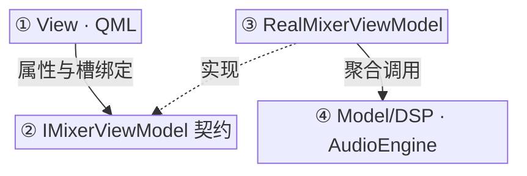
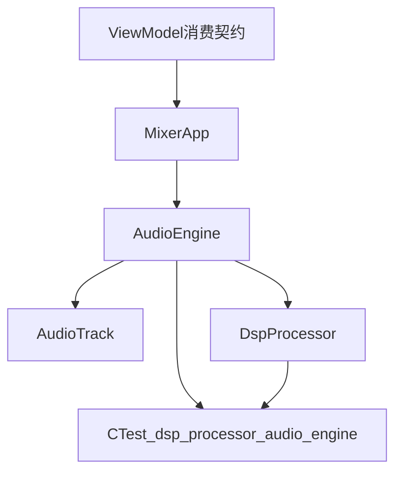

# Mixing Studio 中期整体报告

> 项目名称：Mixing Studio  
> 小组成员：彭福康、张天乐  
> 集成分支：`release/midterm-integration`  
> 对应提交：`194d823`  
> 截止日期：2026-07-14  

**中期交付边界：** 本阶段已完成可运行的 Qt/QML 调音台交互、ViewModel 与 Model 接口对接、Model/DSP 单元测试，以及整体报告与成员分报告。框架设计与待优化项见第四节。真实音频文件解码与声卡输出属下一阶段任务。

最终提交材料为：本总结报告，以及成员彭福康、成员张天乐各自的中期分报告。

---

## 一、项目背景与中期目标

Mixing Studio 是一个基于 **Qt 6、C++17、QML、CMake** 开发的多轨调音项目。目标是逐步实现多轨音频导入、同步播放、音量与声像调节、Mute/Solo、基础 DSP 处理、工程保存与混音导出等能力。

中期阶段的核心目标**不是**一次性完成完整 DAW，而是完成以下可验收成果：

1. 建立可持续协作的工程结构与版本控制流程；
2. 交付可运行的 Qt/QML 前端与可交互调音台原型；
3. 建立清晰的 View / ViewModel / App / Command / Model / DSP 目录边界，保证 QML 不直接访问底层；
4. 提供可测试的 Model/DSP 接口与 CTest 证据；
5. 形成完整的整体报告与成员分报告。

当前集成分支已形成可交互调音台原型，并完成播放时钟、轨道参数、DSP 单帧混音链和 UI 绑定链路的初步打通。

---

## 二、中期评分要求对应情况

中期小结评分标准如下，本报告按三项要素组织证据。

| 评分要素                    | 分值  | 本报告对应章节             | 当前完成情况                                                 |
| ----------------------- | --- | ------------------- | ------------------------------------------------------ |
| 成员协作紧密，且在版本控制系统上都有有效的提交 | 30  | 第三节                 | 已完成。彭/张 独立 feature 分支、有效提交、集成分支齐全；**中期已实现能力已互相测试并通过**。 |
| 完整地按照最先进的框架开发           | 20  | 第四节                 | 中期实际流程见图 4-1；验收期望的优化后流程见图 4-2；对照与优化项见 4.3。             |
| 完整的整体报告和分报告             | 50  | 本文件 + 成员彭/张分报告与过程记录 | 已补齐：一份总结报告；各成员一份中期分报告 + 一份原过程 README。                  |

---

## 三、成员协作与版本控制

### 3.1 分工

| 成员  | 负责范围                                   | 主要产出                                                                |
| --- | -------------------------------------- | ------------------------------------------------------------------- |
| 成员彭 | Model / DSP / 底层测试 / 与 ViewModel 的引擎契约 | `AudioEngine` 播控与轨参数、`DspProcessor` 混音链、CTest、架构检查脚本                |
| 成员张 | ViewModel / View / 报告 / 集成验证           | `MixerViewModel`、`TrackViewModel`、QML 调音台、Sprint 2/3 接口对接、集成分支与报告整合 |

详细技术实现、阶段记录与源码说明分别见成员分报告；本节只保留协作与版本控制证据。

### 3.2 协作方式

开发按“功能分支并行 → 交叉测试 → 合入中期集成分支”推进：

1. 成员彭 在 `feature/A-model-dsp-sprint*` 上分 Sprint 提交 Model/DSP；
2. 成员张 在 `chai/feat` 上分阶段推进 ViewModel/QML；
3. 阶段一曾本地 merge `chai/feat` 做交叉验证；
4. 中期由成员张 创建 `release/midterm-integration`，依次合入 Sprint 2、Sprint 3，作为 GitHub PR 用发布分支。

**图 3-1 协作与分支合并示意**

### 3.3 关键分支

| 分支                                     | 说明                            | 当前状态           |
| -------------------------------------- | ----------------------------- | -------------- |
| `main`                                 | 主分支，远程停在 Sprint 1 合并点附近       | `f715d01`      |
| `feature/A-model-dsp-sprint1-infra`    | 彭侧 Sprint 1 Model/DSP 基建      | 已合入 main       |
| `feature/A-model-dsp-sprint2-playback` | 彭侧 Sprint 2 播放时钟、Seek、Loop、测试 | 已进入集成分支        |
| `feature/A-model-dsp-sprint3-mixing`   | 彭侧 Sprint 3 混音链、轨 DSP 参数、测试   | 已进入集成分支        |
| `chai/feat`                            | 张侧 ViewModel/View 阶段开发分支      | 远程已删除，本地保留提交证据 |
| `release/midterm-integration`          | 中期集成分支                        | 已推送到 GitHub    |

### 3.4 有效提交摘录

| 提交        | 成员  | 内容                                         |
| --------- | --- | ------------------------------------------ |
| `2654de0` | 彭   | Sprint 1：DSP 测试骨架与 `AudioEngine` getter    |
| `9cac45c` | 彭+张 | 本地合并 张侧 ViewModel/View，完成阶段一交叉测试           |
| `b244414` | 彭   | Sprint 2：播放时钟、Seek、Loop 与 `AudioEngine` 测试 |
| `7291c53` | 彭   | Sprint 3：混音链、轨 DSP 参数与测试                   |
| `d7704c2` | 张   | 规划 张侧分阶段实现                                 |
| `f7245af` | 张   | 暴露播放 transport 状态到 ViewModel               |
| `7a25348` | 张   | 建立轨道 Solo/Audible 状态机                      |
| `10f525b` | 张   | 渲染 Mock 波形、电平和频谱                           |
| `60e47c7` | 张   | 增加 Mock 素材库和项目面板                           |
| `f055073` | 张   | 重构调音台工作区布局                                 |
| `b28ea5c` | 张   | 集成 Sprint 2 playback 到中期发布分支               |
| `194d823` | 张   | 集成 Sprint 3 mixing 到中期发布分支                 |

更完整的提交与阶段过程见各成员分报告。

### 3.5 交叉测试摘要

**结论：中期已实现能力均已完成 彭↔张 互相测试并通过。**  
成员彭 测试成员张 的 ViewModel/QML 分层与构建；成员张 测试成员彭 的 Model/DSP 接口、CTest 与集成分支启动。

| 日期         | 方向  | 内容                                                                             | 结果                                        |
| ---------- | --- | ------------------------------------------------------------------------------ | ----------------------------------------- |
| 2026-07-11 | 彭测张 | ViewModel/QML 分层、头文件目录、报告证据、`validate_feature.ps1`、Windows 构建                  | **通过**：静态验证 13/13；`MixingStudio.exe` 构建成功 |
| 2026-07-11 | 彭测张 | 本地 merge `chai/feat`；VM→Model 调用链；QML 不越层；播放/导入转发                              | **通过**：边界检查与合并构建通过                        |
| 2026-07-14 | 张测彭 | macOS 对 `release/midterm-integration` 复测：`dsp_processor` / `audio_engine`、应用启动 | **通过**：CTest 2/2；应用可启动、无 QML runtime 错误   |
| 2026-07-14 | 张测彭 | Sprint 2/3 已对接项：播控时钟、Seek、Master、Volume/Pan/Mute/Solo 经 ViewModel 驱动 Model     | **通过**：集成分支上 UI 可操作并同步到底层接口               |

完整交叉测试过程已记录于协作证据中；中期已实现项结论为互相通过。

---

## 四、项目技术框架

本项目技术栈为 **Qt 6 + QML + C++17 + CMake/CTest**。中期后已按五层图与**接口面向**完成重构：QML 只认 `IMixerViewModel` 契约；`MixingStudioApp` 注入接口指针；`RealMixerViewModel` 聚合 `AudioEngine`。架构真源见仓库根目录架构关系图。

### 4.1 当前框架流程

| 层次 | 当前实现 |
| :--- | :--- |
| View | QML：`Main.qml` 等，绑定 `mixerViewModel` |
| ViewModel 契约 | `IMixerViewModel` / `ITrackViewModel`（`Q_PROPERTY` + 槽/信号） |
| ViewModel 实现 | `RealMixerViewModel` / `TrackViewModel`（QML 不可见） |
| Command | `ICommandBase` + Playback/Project/TrackDsp（操作 `AudioEngine`） |
| App | `MixingStudioApp` 仅装配并注入接口指针 |
| Model / DSP | `AudioEngine`、`DspProcessor` |
| Common | `ICommandBase`、`MixerTypes` |

**图 4-1 当前框架流程（接口注入）**

主路径：`QML → IMixerViewModel → RealMixerViewModel → Command/AudioEngine → DspProcessor`。App 负责创建并用 **接口指针** `setContextProperty`。

### 4.2 与验收期望的关系

中期验收曾指出的优化方向（父级注入、App 服务接口、平台导航等）中，**接口面向的 ViewModel 契约注入**已落地。后续仍可由成员彭继续完善平台/导航服务等项；成员张负责测试审核。

### 4.3 后期分工

| 角色 | 成员 | 主责 |
| :--- | :--- | :--- |
| 架构与实现 | 成员彭 | 五层架构、契约、RealVM、Model、App 装配 |
| 测试与审核 | 成员张 | CTest、validate、冒烟与合入把关 |

---

## 五、成员彭 工作摘要

成员彭 负责 Model、DSP 与底层测试。中期主要完成：

- `AudioEngine`：轨元数据导入、播放状态机、Seek/Loop、主音量、Volume/Pan/Mute/Solo，以及离线混音入口 `renderMixFrame`；
- `DspProcessor`：增益/Pan/EQ 代理/压缩/线性混音/主限幅等纯 C++ 可测工具；
- CTest 与 `validate_feature.ps1`；
- 以最小改动对接张侧 ViewModel。

**边界：** 导入后时长为 180s 占位；`play()` 推进时钟但不向声卡输出；真实解码、分析与持久化未作为中期已完成项。

详细阶段记录、接口说明与源码摘录见成员彭分报告。

**图 5-1 彭侧模块关系**

---

## 六、成员张 工作摘要

成员张 负责 ViewModel、QML View、报告与中期集成。中期主要完成：

- `MixerViewModel` / `TrackViewModel`：播放与轨道状态、Solo/Audible、素材与工程入口属性；
- QML 调音台：Transport、波形/频谱面板、素材库、横向 channel strip；
- Sprint 2/3 对接：进度/Seek/Master、Volume/Pan/Mute/Solo 同步到 Model；
- 创建并维护 `release/midterm-integration`，在 macOS 完成构建与 CTest 复测。

**边界：** 素材库、波形/频谱/电平、工程保存仍为 mock/stub；界面可交互，但不代表真实发声已完成。

详细阶段记录、界面说明与源码摘录见成员张分报告。

### 可运行 UI 截图

中期已可启动并操作调音台界面，截图证据如下：

**图 6-1 主界面运行截图**

**图 6-2 轨道 mixer / Mute-Solo 截图**

**图 6-3 波形与频谱面板截图**

------

## 七、功能完成度

### 7.1 已完成

| 功能                 | 说明                                                        |
| ------------------ | --------------------------------------------------------- |
| Qt/QML 应用启动        | `MixingStudio` 可构建并运行                                     |
| MVVM 工程骨架          | View / ViewModel / App / Command / Model / DSP 目录与基本分层可运行 |
| 轨道导入入口             | 中期入口可用；导入的是 mock/占位轨道                                     |
| 播放控制               | Play/Pause/Stop、位置、Seek、时长显示                              |
| 主音量 / 轨 Volume/Pan | UI → ViewModel → Model 同步                                 |
| Mute/Solo          | UI 状态、Audible 规则与 Model 参数同步                              |
| 波形/频谱/电平显示         | mock 数据可视化消费路径已通                                          |
| DSP 单帧混音链          | 有单元测试                                                     |
| CMake/CTest / 架构检查 | CTest 2/2；`validate_feature` 13/13                        |
| 报告证据               | 整体报告、彭/张中期分报告与过程 README、shared 记录                         |

### 7.2 未完成

| 项目               | 说明                            |
| ---------------- | ----------------------------- |
| 真实音频能力           | WAV 解码、`QAudioSink` 输出、真实分析数据 |
| 真实 WAV/PCM 解码    | 当前占位时长，不读真实文件样本               |
| 声卡输出             | `play()` 不驱动 `QAudioSink`     |
| 真实波形/频谱          | 仍为 mock                       |
| 工程持久化 / WAV 导出   | stub 或未合入中期交付                 |
| EQ/Compressor UI | Model API 已有，UI 未挂            |

---

## 八、测试与工具链证据

### 8.1 环境

| 平台      | 维护者 | 工具链                                           |
| ------- | --- | --------------------------------------------- |
| Windows | 彭   | Qt 6.8.3 MSVC2022、CMake 3.31、VS 2022              |
| macOS   | 张   | Homebrew Qt 6.11.1、CMake 4.3.4、Apple clang 17 |

工具链与构建命令见第八节上文及成员分报告中的自测记录。

### 8.2 集成分支测试结果

补充：`MixingStudio` Debug 构建通过；`validate_feature.ps1` 架构边界 **13/13** 通过。

---

## 九、问题反思与下一阶段计划

### 9.0 后期分工重新规划

中期按「成员彭：Model/DSP，成员张：ViewModel/View」并行推进。进入后期后，分工调整为**一人主责框架完善与功能实现，一人主责集成测试**：

| 角色        | 成员  | 主责                        | 产出与边界                                                                     |
| --------- | --- | ------------------------- | ------------------------------------------------------------------------- |
| **主框架撰写** | 成员彭 | 按验收框架优化项补齐接口与依赖方向，并推进真实音频 | View 注入、App 服务接口、App 编排 Command、平台服务、绑定规范；WAV/PCM、`QAudioSink`、真实分析与必要 UI |
| **集成测试**  | 成员张 | 对框架与功能合入做独立集成与回归          | 集成分支/PR、构建与 CTest、分层与发声冒烟、合入把关                                            |

协作节奏：成员彭小步提交 → 成员张复测通过 → 再进入下一项。

### 9.1 框架完善任务清单

按第四节 4.3 执行：View 注入、App 编排 Command、抽出 App 服务接口、平台/导航服务、统一绑定与命令入口。

### 9.2 真实音频链路任务清单

1. QML `FileDialog` 选择本地 `.wav`；
2. Model 层 PCM WAV 解析；
3. `QAudioSink` 真实输出；
4. 多轨 PCM 接入现有 Volume/Pan/Mute/Solo/Master 混音链；
5. 真实 waveform / VU / 频谱替换 mock；
6. 补齐 EQ/Compressor UI、工程保存与导出。

### 9.3 集成测试关注点

1. 每次合入后跑通架构边界检查与全量 CTest；
2. 验证 UI 仅经 ViewModel、依赖方向符合分层；
3. 对真实音频链路做端到端冒烟；
4. 维护集成测试记录，作为期末验收证据。

---
## 十、中期结论

截至集成分支 `release/midterm-integration`：

1. **协作：** 成员彭/张均有独立分支、有效提交与集成发布分支；中期已实现能力已完成彭↔张互相测试并通过。
2. **框架：** 中期实际框架见图 4-1，验收时期望的优化后框架见图 4-2，对照分析与优化项见 4.3。
3. **报告：** 总结报告已齐备；成员彭、成员张各自目录含中期分报告与原过程 README。

当前版本可作为中期展示与后续完善的基础。后期按「成员彭主框架撰写、成员张集成测试」推进真实音频与框架细节落地。