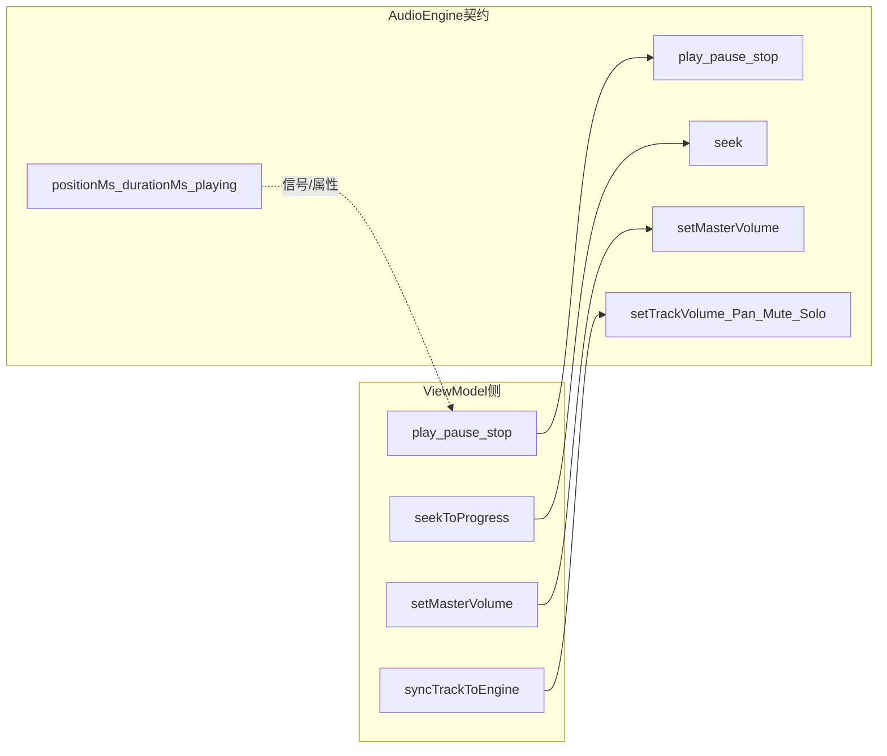

# 成员彭福康 中期分报告

> 成员彭福康：Model / DSP / Persistence / 底层测试  
> 对应当前集成分支：`release/midterm-integration`  
> 最新集成提交：`194d823 merge: integrate sprint3 mixing`  
> 截止日期：2026-07-14

本文件为成员彭福康 的中期分报告，包含实现细节、阶段过程、测试证据与必要源码说明。

---

## 一、个人负责内容概述

本人在本项目中主要负责 Model、DSP、底层测试脚本，以及与 ViewModel 对接的音频引擎契约。具体包括：

1. 设计并实现 `AudioEngine`：轨元数据导入、播放状态机、Seek/Loop、主音量、轨道 Volume/Pan/Mute/Solo，以及离线混音入口 `renderMixFrame`。
2. 设计并实现纯 C++ `DspProcessor`：样本限幅、增益、声像、三段 EQ 代理、压缩器、单轨处理、线性混音与 master 限幅，便于单元测试且不依赖 Qt UI。
3. 搭建 CMake/CTest 与 `scripts/run_tests.*`、`validate_feature.ps1`，用自动化测试证明 Model/DSP 行为，并用架构检查保证 QML 不直接访问 Model/DSP。
4. 在 Sprint 2/3 中以最小改动对接 张侧 ViewModel：播控时钟与 Seek 由 Model 提供；Volume/Pan/Mute/Solo 经 ViewModel 同步进引擎；EQ/Compressor/Bypass 仅提供 Model API，不改张侧 EQ UI。
5. 按阶段在 `feature/A-model-dsp-sprint*` 分支提交，供成员张 合入 `release/midterm-integration` 作为中期发布分支。

### 负责模块路径

- `include/DSP/`、`src/DSP/`
- `include/Model/`、`src/Model/`
- `tests/` 单元测试与 `scripts/` 验证脚本
- 波形/VU/频谱、工程保存、素材库、WAV 导出

---

## 二、与评分要求的对应

| 评分项 | 彭侧贡献 |
| :--- | :--- |
| 成员协作与有效提交 | 彭侧在独立 feature 分支完成 Sprint 1–3 提交并推送；Sprint 2/3 由成员张合入 `release/midterm-integration`；阶段一曾与成员张的 `chai/feat` 本地交叉合并验证。 |
| 先进框架开发 | 彭侧使用 C++17 + Qt 6 + CMake/CTest；Model/DSP 经 ViewModel 契约暴露，QML 不直接调用。 |
| 完整报告 | 本分报告记录彭侧过程、测试、AI 使用与阶段证据。 |

---

## 三、有效提交记录

| 提交 | 类型 | 内容 |
| :--- | :--- | :--- |
| `2654de0` | Model/DSP | Sprint 1：DSP 测试骨架与 `AudioEngine` getter |
| `9cac45c` | 交叉 | 本地合并 张侧 ViewModel/View，完成阶段一交叉测试 |
| `7e49d75` | 报告 | 记录阶段一交叉测试与工具链 |
| `b244414` | Model | Sprint 2：播放时钟、Seek、Loop 与 `AudioEngine` 测试 |
| `7291c53` | Model/DSP | Sprint 3：混音链、轨 DSP 参数与测试 |
| `6e9a5aa` | 报告 | 记录 Sprint 3 提交哈希 |
| `b28ea5c` | 集成 | 成员张合入 Sprint 2 playback |
| `194d823` | 集成 | 成员张合入 Sprint 3 mixing |

---

## 四、彭侧技术实现

### 4.1 AudioEngine：播放与轨参数

`AudioEngine` 是 Model 层对外主入口。中期已提供的能力包括：

| 接口类别 | 代表 API | 中期含义 |
| :--- | :--- | :--- |
| 轨管理 | `importTrack` / `clearTracks` | 注册占位轨元数据 |
| 播控 | `play` / `pause` / `stop` | 播放状态与定时推进 |
| 定位 | `seek` / `setLoopRange` | 进度跳转与循环区间 |
| 主音量 | `setMasterVolume` | 主音量限制在 `[0, 1]` |
| 轨混音参数 | `setTrackVolume` / `setTrackPan` / `setTrackMuted` / `setTrackSolo` | 供 ViewModel 同步 |
| FX API | `setTrackEq` / `setTrackCompressor` / `setTrackFxBypass` | Model 已提供；UI 未挂 |
| 离线混音 | `renderMixFrame` | 按 Mute/Solo 可听性做立体声混音帧 |
| 绑定属性 | `positionMs` / `durationMs` / `playing` 等 | 供上层消费 |

导入后默认占位时长 **180000 ms**，为后续真实解码保留接口形状。

对外门面接口摘录：

```15:68:include/Model/AudioEngine.h
class AudioEngine : public QObject
{
    Q_OBJECT
    Q_PROPERTY(bool playing READ isPlaying NOTIFY playbackStateChanged)
    Q_PROPERTY(int positionMs READ positionMs NOTIFY positionChanged)
    Q_PROPERTY(int durationMs READ durationMs NOTIFY durationChanged)
    Q_PROPERTY(float masterVolume READ masterVolume WRITE setMasterVolume NOTIFY masterVolumeChanged)
    // ...
public slots:
    void importTrack(const QString &path);
    void play();
    void pause();
    void stop();
    void seek(int positionMs);
    void setMasterVolume(float volume);
    void setTrackVolume(int index, float volume);
    void setTrackPan(int index, float pan);
    void setTrackMuted(int index, bool muted);
    void setTrackSolo(int index, bool solo);
    void setTrackEq(int index, float lowDb, float midDb, float highDb);
    void setTrackCompressor(int index, float threshold, float ratio);
    void setTrackFxBypass(int index, bool bypass);
```

**图 A-1 AudioEngine 与 ViewModel 契约示意**



### 4.2 DspProcessor：混音链

`DspProcessor` 为无 Qt UI 依赖的纯函数工具集，由 `test_dsp_processor` 直接断言，不经过 QML。中期覆盖：

- 基础：`clampSample`、`applyGain`、`panLeftGain` / `panRightGain`、`dbToLinear`
- 单轨：三段 EQ 宽带增益代理、压缩器、`processTrackSample`
- 总线：线性混音、`applyMasterChain` 主音量与限幅

```22:36:include/DSP/DspProcessor.h
// Realtime mix chain: gain, pan, EQ, compressor, linear sum, master limit.
class DspProcessor
{
public:
    static float clampSample(float sample);
    static float applyGain(float sample, float gain);
    static float panLeftGain(float pan);
    static float panRightGain(float pan);
    static float dbToLinear(float gainDb);
    static float applyThreeBandEq(float sample, float lowDb, float midDb, float highDb);
    static float applyCompressor(float sample, float threshold, float ratio);
    static StereoSample processTrackSample(float monoSample, const TrackProcessParams &params);
    static StereoSample mixLinear(const StereoSample &accumulator, const StereoSample &track);
    static StereoSample applyMasterChain(const StereoSample &mixed, float masterVolume);
};
```

`MixerApp` 作为用例层门面，编排对 `AudioEngine` 的调用，对应本项目 App 应用服务层。

```7:35:src/App/MixerApp_Playback.cpp
void MixerApp::play()
{
    if (m_engine) {
        m_engine->play();
    }
}

void MixerApp::pause()
{
    if (m_engine) {
        m_engine->pause();
    }
}

void MixerApp::stop()
{
    if (m_engine) {
        m_engine->stop();
    }
}

void MixerApp::seekToProgress(float progress)
{
    if (!m_engine || m_engine->durationMs() <= 0) {
        return;
    }
    // ...
}
```

### 4.3 测试与验证脚本

| 资产 | 作用 |
| :--- | :--- |
| `tests/test_dsp_processor.cpp` | 限幅、增益、声像、EQ/压缩、混音与 master 链 |
| `tests/test_audio_engine.cpp` | 导入、播放推进、暂停、Seek clamp、Loop、主音量与轨参数/混音帧 |
| `scripts/run_tests.ps1` / `run_tests.sh` | 一键配置、构建、CTest |
| `scripts/validate_feature.ps1` | 架构边界检查 |

中期集成分支上 CTest 目标为 **2/2**。

### 4.4 与 ViewModel 的契约

- **Sprint 2：** 成员张将进度/Seek/Master 从 ViewModel 自维护秒表改为消费 `AudioEngine` 时钟。
- **Sprint 3：** 成员张通过 `syncTrackToEngine()` 把 Volume/Pan/Mute/Solo 写入 Model；成员彭不改成员张的 EQ/压缩 UI。
- 波形/频谱/素材库/工程面板仍由 张侧 Mock；彭侧分析与持久化未进入本次中期集成交付。

---

## 五、当前实现边界

需要明确：彭侧中期交付的是**可测试的播控与混音参数链路**，不是完整真实音频 I/O。

### 5.1 当前能用的部分

- `AudioEngine` 播放时钟、Seek、Loop、主音量可被 ViewModel 驱动；
- 多轨 Volume/Pan/Mute/Solo 可写入 Model，并参与 `renderMixFrame`；
- DSP 混音链与引擎行为可用 CTest 证明；
- 架构检查可通过，QML 不直接访问 Model/DSP。

### 5.2 当前仍是占位或未合入中期的部分

- `importTrack` 不解码真实 WAV；时长为 180s 占位；
- `play()` 推进时钟，不向声卡输出真实声音；
- EQ/Compressor/Bypass 有 Model API 与单测，无对应 UI；
- 波形/VU/频谱真实分析、SQLite 素材库、JSON 工程保存。

---

## 六、自测与集成验证

彭侧在 Windows上对 Sprint 2/3 及中期等价能力完成构建与测试：

```powershell
.\scripts\run_tests.ps1 -QtPath "D:\Qt\6.5.3\msvc2019_64"
cmake --build build --config Debug --target MixingStudio
.\scripts\validate_feature.ps1
```

测试结果：


补充检查：

- `MixingStudio` Debug 构建通过；
- `validate_feature.ps1` 架构边界 **13/13** 通过。

张侧已在 macOS 对 `release/midterm-integration` 复测 CTest 2/2 与应用启动。

---

## 七、问题反思与后期优化

### 7.1 功能缺口

彭侧前期用占位时长与离线 `renderMixFrame` 推进接口，与成员张并行开发 UI。当前功能缺口是：控制链与混音参数已通，真实解码与声卡输出未通。

### 7.2 框架完善要点

本项目后续需按总结报告第四节验收框架优化项完善：App 编排 Command，ViewModel / Command 依赖服务接口而非具体 `MixerApp`。由成员彭主责实现，成员张负责集成测试验收。

### 7.3 下一阶段分工与彭侧计划

后期分工：**成员彭主责框架撰写与功能实现，成员张主责集成测试**。

彭侧主责内容：

1. 按总结报告第四节验收框架优化项完善 View 注入、App 服务接口、App 编排 Command、平台服务与绑定规范；
2. 更新结构说明与架构检查脚本；
3. 提供 WAV/PCM 解码，替换占位轨；用 `QAudioSink` 实现真实输出；
4. 完成真实分析数据与持久化，并挂接必要 UI；
5. 以小步提交供成员张做集成验收，不以自测代替合入标准。

---

## 八、个人小结

到中期为止，彭侧完成了 Model/DSP 从测试骨架到播控时钟、再到多轨混音参数链的分层实现，并用 CTest 与架构脚本固化证据。主要贡献集中在 `AudioEngine`、`DspProcessor`、单元测试与对 ViewModel 的稳定契约。当前成果足以支撑中期报告中关于协作、底层过程与测试证据的要求；框架分层与真实音频链路仍需在下一阶段继续完成。

---

## 九、AI 使用汇总

彭侧开发采用「AI 主导代码生成 / 合并验证，人工审查、测试与边界确认」模式。各阶段使用记录如下：

| 日期 | 阶段 | 模型 | 采用模式 | 提示词摘要 | 对应提交 |
| :--- | :--- | :--- | :--- | :--- | :--- |
| 2026-07-11 | 交叉测试 / 验证脚本 | Codex | AI 生成脚本，人工运行 | 按 MVVM 分层与互测要求编写可重复验证脚本 | `4fcbeaa` |
| 2026-07-11 | Windows Qt 环境 | Codex | AI 辅助配置，人工验证 | 安装 Qt 并保留可复用 Windows 构建脚本 | `dbe9213` |
| 2026-07-11 | 阶段 1 Model/DSP 基建 | Codex | AI 主导生成，人工审查合并 | 实现 `DspProcessor`、`AudioEngine`、CTest 与 `run_tests` | `2654de0` |
| 2026-07-11 | 阶段 1.1 与张侧合并交叉 | Codex | AI 主导合并，人工确认边界 | merge `chai/feat`，验证 VM→Model 与 QML 不越层 | `9cac45c` |
| 2026-07-11 | 阶段 2 播放闭环 | Codex | AI 主导生成，人工测试 | 播放时钟、Seek/Loop、`test_audio_engine`、进度对接 | `b244414` |
| 2026-07-14 | 阶段 3 混音与 DSP | Cursor Grok | AI 主导生成，人工规划单测 | 混音链、轨参、EQ/压缩/Bypass API 与扩展 CTest | `7291c53` |

采用模式说明：AI 负责高频生成与补全；人工负责分层边界、构建验收、交叉测试与报告证据。

---

## 十、阶段过程记录

### 阶段记录模板

- 日期：
- 使用的大模型：
- 采用模式：
- 提示词摘要：
- AI 输出内容：
- 人工修改内容：
- 自测结果：
- 成员张交叉测试结果：
- 对应提交：
- 可放入报告的证据：

### 阶段拆分

1. 阶段 1：搭建 CMake、`DspProcessor`、`AudioEngine` 基础接口和 DSP 测试骨架。
2. 阶段 2：跑通导入、多轨、播放状态、Seek、Loop、主音量底层接口。
3. 阶段 3：实现多轨线性混音、主输出限幅、轨道音量/Pan/EQ/压缩等底层处理。
4. 阶段 4：波形降采样、VU、频谱、峰值/削波；SQLite 素材库与 JSON 工程保存/加载。
5. 阶段 5：WAV 导出验收、测试补齐与底层架构检查清单。

### 阶段 1：Model/DSP 基建与测试骨架

- 日期：2026-07-11
- 使用的大模型：Codex
- 采用模式：AI 主导代码生成，人工审查、构建验证、本地合并。
- 提示词摘要：实现阶段一基建功能，包括 `DspProcessor`、`AudioEngine` 基础接口、CMake 测试骨架，并与成员张 feat 分支本地合并测试阶段一。
- AI 输出内容：
  - `DspProcessor` 移除对 Qt 的依赖，保留 `clampSample`、`applyGain`、`panLeftGain`、`panRightGain` 等阶段一基础函数。
  - `AudioEngine` 在骨架上补充 `masterVolume()` 读取接口，并对主音量做 `[0, 1]` clamp。
  - 新增 `tests/test_dsp_processor.cpp`，覆盖限幅、增益、声像等断言。
  - `CMakeLists.txt` 增加 `enable_testing()` 和 `test_dsp_processor` CTest 目标。
  - 新增 `scripts/run_tests.ps1` 和 `scripts/run_tests.sh`，支持一键配置、构建和测试。
- 人工修改内容：从 `main` 基线创建 `feature/A-model-dsp-sprint1-infra`，仅实现阶段一范围；提交后本地 merge `origin/chai/feat`，保留张侧 ViewModel/QML。
- 自测结果：
  - 已运行 `.\scripts\run_tests.ps1 -QtPath "D:\Qt\6.5.3\msvc2019_64" -WithApp`，CTest 通过。
  - 已运行 `.\scripts\validate_feature.ps1`，架构边界检查 13/13 通过。
  - 已构建 `MixingStudio.exe`，合并后应用构建成功。
- 成员张交叉测试结果：待成员张在 macOS 复测。
- 对应提交：`2654de0`
- 可放入报告的证据：`DspProcessor` 基础函数、`test_dsp_processor`、CTest 输出、`run_tests.ps1` 执行记录。

### 阶段 1.1：与成员张 feat 本地合并交叉测试

- 日期：2026-07-11
- 使用的大模型：Codex
- 采用模式：AI 主导合并与验证，人工确认接口边界。
- 提示词摘要：将 `origin/chai/feat` 合并到彭侧阶段一分支，验证 MVVM 边界和 ViewModel 对 `AudioEngine` 的调用链。
- AI 输出内容：
  - 本地 merge `origin/chai/feat` 到 `feature/A-model-dsp-sprint1-infra`，CMake 自动合并成功。
  - 保留张侧 `MixerViewModel`、`TrackViewModel`、`Main.qml` 与彭侧 Model/DSP/测试目标共存。
  - 更新交叉测试与工具链记录。
- 人工修改内容：确认 QML 不直接访问 Model/DSP；确认 `play`/`pause`/`stop`/`importTrack` 均通过 ViewModel 转发。
- 自测结果：
  - QML 不直接访问 `AudioEngine`/`DspProcessor`，`validate_feature.ps1` 通过。
  - `MixerViewModel` 播控与导入转发审查通过。
  - `playbackStateChanged` 已连接至 ViewModel 播放逻辑。
- 成员张交叉测试结果：彭侧本地交叉测试通过；待张侧复测接口可用性与 DSP 测试结果。
- 对应提交：`9cac45c`、`7e49d75`
- 可放入报告的证据：`validate_feature.ps1` 输出、合并后构建日志、交叉测试记录。

### 阶段 2：播放闭环底层接口

- 日期：2026-07-11
- 使用的大模型：Codex
- 采用模式：AI 主导代码生成，人工构建与测试验证。
- 提示词摘要：跑通本地音频导入、多轨加载、播放状态、Seek、Loop、主音量底层接口。
- AI 输出内容：
  - `AudioEngine` 增加 `AudioTrack` 元数据、`positionMs`/`durationMs`、播放定时器推进、`seek`、`setLoopRange`、`clearTracks`。
  - 导入后使用 180000ms 占位时长。
  - 新增 `tests/test_audio_engine.cpp`，覆盖导入、播放推进、暂停、Seek clamp、Loop、主音量边界。
  - 最小改动对接 ViewModel：进度与 Seek 改为消费 Model 时钟，Mock 波形/频谱仍由张侧刷新。
  - 更新 `run_tests.ps1` 运行全部 CTest。
- 人工修改内容：默认不自动开启 Loop；从阶段一分支创建 `feature/A-model-dsp-sprint2-playback`。
- 自测结果：
  - `cmake --build build --config Debug` 通过。
  - `ctest --test-dir build -C Debug --output-on-failure`，CTest 2/2 通过。
- 成员张交叉测试结果：待张侧用 UI 验证 Play/Pause/Stop/Seek/进度条与 Model 时钟一致。
- 对应提交：`b244414`
- 可放入报告的证据：`test_audio_engine.cpp`、CTest 2/2 输出、播放进度对接代码。

### 阶段 3：混音与 DSP 闭环

- 日期：2026-07-14
- 使用的大模型：Cursor Grok
- 采用模式：AI 主导代码生成，人工规划测试用例与构建验证。
- 提示词摘要：完成彭侧阶段三：多轨线性混音、主输出限幅、轨道音量/Pan、三段 EQ、Compressor、Bypass 底层；自主规划测试并写入报告。不改张侧 EQ/压缩 UI。
- AI 输出内容：
  - 扩展 `DspProcessor`：`dbToLinear`、三段 EQ、压缩器、`processTrackSample`、线性混音、`applyMasterChain` 限幅。
  - 扩展 `AudioEngine` 轨参数与 `renderMixFrame` 离线混音。
  - 最小对接：Volume/Pan/Mute/Solo 经 ViewModel 同步到 Model；EQ/Comp/Bypass 仅 Model API + 单测。
  - 扩展 `test_dsp_processor` 与 `test_audio_engine` 阶段三断言。
- 人工修改内容：分支 `feature/A-model-dsp-sprint3-mixing`；EQ 为可测宽带增益代理。
- 自测结果：
  - `.\scripts\run_tests.ps1 -QtPath "D:\Qt\6.5.3\msvc2019_64"` → CTest 2/2 通过。
  - `cmake --build build --config Debug --target MixingStudio` 通过。
  - `.\scripts\validate_feature.ps1` → 13/13 通过。
- 成员张交叉测试结果：待张侧后续实现 EQ/Comp/Bypass 控件后再做 UI 交叉；当前可用单测验收彭侧底层。
- 对应提交：`7291c53`
- 可放入报告的证据：`DspProcessor` 混音链、`AudioEngine::renderMixFrame`、扩展后的 CTest 输出。
