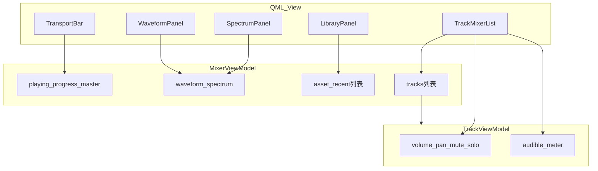

# 成员张天乐 中期分报告

> 成员张天乐：ViewModel / View / Report / 集成验证  
> 对应当前集成分支：`release/midterm-integration`  
> 最新集成提交：`194d823 merge: integrate sprint3 mixing`  
> 截止日期：2026-07-14

本文件为成员张天乐的中期分报告，包含界面与 ViewModel 实现、阶段过程、集成验证与必要源码说明。

---

## 一、个人负责内容概述

本人在本项目中主要负责 ViewModel、QML View、报告材料和中期集成验证。具体包括：

1. 设计并实现 `MixerViewModel` 与 `TrackViewModel`，为 QML 暴露播放状态、轨道状态、素材列表、波形/频谱/电平数据和用户操作入口。
2. 设计并实现 `src/View/Main.qml` 调音台界面，包括 Transport、播放进度、Master 音量、Waveform、Spectrum、素材库、最近工程和横向 mixer channel strip。
3. 在成员彭 的 `AudioEngine` 接口逐步完善后，将 ViewModel 的播放进度、Seek、Master、Volume、Pan、Mute、Solo 同步到底层 Model。
4. 维护报告目录结构，记录 张侧过程、AI 使用、构建测试、交叉测试和中期整体报告。
5. 创建并推送 `release/midterm-integration` 分支，将成员彭 的 Sprint 2 和 Sprint 3 分支按顺序集成，作为 GitHub PR 使用的中期发布分支。

### 负责模块路径

- `include/ViewModel/`、`src/ViewModel/`
- `src/View/`
- `report/` 报告结构、截图证据与总报告整合
- 轨道状态机、波形/VU/频谱显示

---

## 二、与评分要求的对应

| 评分项 | 张侧贡献 |
| :--- | :--- |
| 成员协作与有效提交 | 张侧在 `chai/feat` 上完成多阶段 ViewModel/View 提交；在 `release/midterm-integration` 上完成 Sprint 2、Sprint 3 两次集成 merge 并推送远程。 |
| 先进框架开发 | 张侧使用 Qt 6 QML + C++17；QML 只绑定 ViewModel，不直接访问 `AudioEngine` 或 `DspProcessor`。 |
| 完整报告 | 整理本分报告，含 AI 使用与阶段过程记录，并参与整体报告撰写。 |

---

## 三、有效提交记录

| 提交 | 类型 | 内容 |
| :--- | :--- | :--- |
| `d7704c2` | 规划 | 规划 张侧分阶段实现方案 |
| `f7245af` | ViewModel | 暴露 mock 播放 transport 状态 |
| `f109d01` | 报告 | 记录 张侧阶段一验证 |
| `7739f16` | 构建 | 分离可执行输出和 QML module 输出 |
| `7a25348` | ViewModel | 建立轨道 Solo 和 Audible 状态 |
| `85ebefd` | 报告 | 记录轨道状态验证 |
| `10f525b` | View/QML | 渲染 mock waveform、spectrum 和 meters |
| `db1fecd` | 报告 | 记录 mock 可视化验证 |
| `60e47c7` | View/QML | 增加 mock 素材库和项目面板 |
| `66c4564` | 报告 | 记录素材库验证 |
| `8680017` | View/QML | 收紧 mixer panel 布局 |
| `f055073` | View/QML | 重构 mixer workspace 布局 |
| `d450e1c` | 报告 | 记录 UI review redesign |
| `8dda167` | View/QML | 保证启动时 mixer 可见 |
| `4fcbeaa` | View/QML | 将项目素材库面板移动到左侧 |
| `b28ea5c` | 集成 | 合入 Sprint 2 playback |
| `194d823` | 集成 | 合入 Sprint 3 mixing |

---

## 四、张侧技术实现

### 4.1 MixerViewModel：状态与命令入口

`MixerViewModel` 把底层能力转换为 QML 易绑定的属性和槽。主要属性包括：`tracks`、`playing`、`statusMessage`、`masterVolume`、`positionSeconds`、`durationSeconds`、`playbackProgress`、`playbackTimeText`、`anySolo`、`waveformPoints`、`spectrumLevels`、`assetSearchText`、`filteredAssetNames`、`recentProjectNames`。

主要槽函数：`importMockTrack`、`importAssetByName`、`restoreRecentProject`、`saveMockProject`、`play`、`pause`、`stop`、`seekToProgress`、`setMasterVolume`、`setAssetSearchText`。

ViewModel 对外属性面摘录：

```13:33:include/ViewModel/MixerViewModel.h
// ViewModel: QML binding surface + presentation state. Use cases go through MixerApp.
class MixerViewModel : public QObject
{
    Q_OBJECT
    Q_PROPERTY(QQmlListProperty<TrackViewModel> tracks READ tracks NOTIFY tracksChanged)
    Q_PROPERTY(bool playing READ playing NOTIFY playingChanged)
    Q_PROPERTY(QString statusMessage READ statusMessage NOTIFY statusMessageChanged)
    Q_PROPERTY(float masterVolume READ masterVolume WRITE setMasterVolume NOTIFY masterVolumeChanged)
    Q_PROPERTY(int positionSeconds READ positionSeconds NOTIFY playbackPositionChanged)
    Q_PROPERTY(int durationSeconds READ durationSeconds NOTIFY durationChanged)
    Q_PROPERTY(float playbackProgress READ playbackProgress NOTIFY playbackPositionChanged)
    Q_PROPERTY(QString playbackTimeText READ playbackTimeText NOTIFY playbackPositionChanged)
    Q_PROPERTY(bool anySolo READ anySolo NOTIFY soloStateChanged)
    // ...
public:
    explicit MixerViewModel(MixerApp *app, QObject *parent = nullptr);
```

用户操作经 Command 转发：

```171:206:src/ViewModel/MixerViewModel.cpp
void MixerViewModel::play()
{
    PlayCommand(m_app).execute();
}

void MixerViewModel::pause()
{
    PauseCommand(m_app).execute();
}

void MixerViewModel::stop()
{
    StopCommand(m_app).execute();
}

void MixerViewModel::setMasterVolume(float volume)
{
    if (!m_app) {
        return;
    }

    SetMasterVolumeCommand command(m_app, volume);
    command.execute();
    // ...
}

void MixerViewModel::seekToProgress(float progress)
{
    SeekProgressCommand(m_app, progress).execute();
}
```

<div style="page-break-after: always; break-after: page;"></div>

在 Sprint 2 集成后，播放位置、时长和 Seek 由底层时钟提供，不再只由 ViewModel 自己维护秒表。  
在 Sprint 3 集成后，轨道 Volume、Pan、Mute、Solo 通过 `syncTrackToEngine()` 同步到 Model。

```54:67:src/ViewModel/MixerViewModel_Sync.cpp
void MixerViewModel::syncTrackToEngine(int index)
{
    if (!m_app || index < 0 || index >= m_tracks.size()) {
        return;
    }

    const TrackViewModel *track = m_tracks.at(index);
    TrackDspParams params;
    params.volume = track->volume();
    params.pan = track->pan();
    params.muted = track->muted();
    params.solo = track->solo();
    ApplyTrackDspCommand(m_app, index, params).execute();
}
```

**图 B-1 ViewModel 属性与 QML 绑定关系**



### 4.2 TrackViewModel：单轨状态机

`TrackViewModel` 负责单条轨道的界面状态：`name`、`volume`、`pan`、`muted`、`solo`、`audible`、`meterLevel`，以及 `volumeText` / `panText` / `meterText` 回显。

其中 `audible` 由 Mute 与 Solo 屏蔽规则共同决定，避免 QML 自行判断复杂业务逻辑。Solo 规则在 `MixerViewModel::refreshSoloState()` 中统一计算，再回写各轨 `setBlockedBySolo`。

```6:18:include/ViewModel/TrackViewModel.h
class TrackViewModel : public QObject
{
    Q_OBJECT
    Q_PROPERTY(QString name READ name CONSTANT)
    Q_PROPERTY(float volume READ volume WRITE setVolume NOTIFY volumeChanged)
    Q_PROPERTY(float pan READ pan WRITE setPan NOTIFY panChanged)
    Q_PROPERTY(bool muted READ muted WRITE setMuted NOTIFY mutedChanged)
    Q_PROPERTY(bool solo READ solo WRITE setSolo NOTIFY soloChanged)
    Q_PROPERTY(bool audible READ audible NOTIFY audibleChanged)
    Q_PROPERTY(QString volumeText READ volumeText NOTIFY volumeChanged)
    Q_PROPERTY(QString panText READ panText NOTIFY panChanged)
    Q_PROPERTY(float meterLevel READ meterLevel NOTIFY meterLevelChanged)
    Q_PROPERTY(QString meterText READ meterText NOTIFY meterLevelChanged)
```

### 4.3 QML 界面结构

`Main.qml` 组装为可操作的调音台：

| 区域 | 组件 | 内容 |
| :--- | :--- | :--- |
| 顶部 | `TransportBar.qml` | Import、Play/Pause、Stop、时间码、进度、Master、状态 |
| 中部 | `WaveformPanel.qml` / `SpectrumPanel.qml` | 分析面板、网格、播放位置线 |
| 左侧 | `LibraryPanel.qml` | 最近工程、保存、素材搜索与导入 |
| 主区 | `TrackMixerList.qml` | 横向 channel strip：电平、推子、Pan、Mute、Solo |

应用入口通过上下文属性注入 ViewModel：

```13:19:src/main.cpp
    AudioEngine audioEngine;
    MixerApp mixerApp(&audioEngine);
    MixerViewModel mixerViewModel(&mixerApp);

    QQmlApplicationEngine engine;
    engine.rootContext()->setContextProperty("mixerViewModel", &mixerViewModel);
    engine.loadFromModule("MixingStudio", "Main");
```

### 4.4 报告与集成

张侧负责把开发过程转化为可检查证据：

- 本分报告记录各阶段 AI 使用、实现、人工修改、自测与提交；
- 工具链、交叉测试与 AI 使用过程写入本报告各阶段记录；
- 中期整体报告中的 张侧摘要与集成说明；
- 创建 `release/midterm-integration` 并依次 merge Sprint 2/3。

---

## 五、当前实现边界

需要明确：张侧当前实现的是**可交互调音台界面和接口绑定链路**，不是完整真实音频播放链路。

### 5.1 当前能用的部分

- 可以启动 Qt/QML 应用；
- 可以通过 Import 或素材库入口创建轨道；
- 可以操作 Play/Pause/Stop、Seek、Master；
- 可以操作单轨 Volume、Pan、Mute、Solo；
- 可以看到 waveform、spectrum、meter 的动态变化；
- UI 控件能够通过 ViewModel 同步到 `AudioEngine` 对应接口。

### 5.2 当前仍是 mock 或 stub 的部分

- 素材库是内置 mock 名称，不是磁盘文件浏览；
- `AudioEngine::play()` 推进播放时钟，不向声卡输出真实声音；
- waveform、spectrum、meter 是确定性模拟数据，不是从真实 PCM 计算；
- 最近工程和保存快照是界面入口，未实现真实 JSON/数据库持久化。

该边界在中期报告中必须诚实说明。下一阶段需优先把 mock 导入替换为真实 WAV 导入和声卡输出。

---

## 六、自测与集成验证

张侧在 macOS 上对中期集成分支完成构建和测试：

```bash
cmake -S . -B build-midterm \
  -DCMAKE_PREFIX_PATH=/opt/homebrew \
  -DQt6_DIR=/opt/homebrew/lib/cmake/Qt6 \
  -DQt6Qml_DIR=/opt/homebrew/lib/cmake/Qt6Qml \
  -DQt6Quick_DIR=/opt/homebrew/lib/cmake/Qt6Quick \
  -DQt6QuickControls2_DIR=/opt/homebrew/lib/cmake/Qt6QuickControls2

cmake --build build-midterm --config Debug --target MixingStudio
ctest --test-dir build-midterm -C Debug --output-on-failure
```

测试结果：


应用启动检查：

- `MixingStudio` 可执行文件构建成功；
- 本地启动后未出现终端 QML/runtime 错误。

### 可运行 UI 截图

以下为中期可测试界面截图：

**图 B-1 主界面运行截图**


**图 B-2 轨道 mixer / Mute-Solo 截图**


**图 B-3 波形与频谱面板截图**


---

## 七、问题反思与后期优化

### 7.1 功能缺口

张侧前期采用 mock 数据推进 UI，因为成员彭的底层接口尚未稳定。中期以后，mock 不能继续作为主要功能实现。最明显的缺口是：**界面像真实调音台，但音频链路还没有真实发声。**

### 7.2 框架完善与集成验收

本项目采用 MVVM 分层。后期由成员彭主责按总结报告第四节设计完善框架与真实音频，成员张主责集成测试验收。

### 7.3 下一阶段分工与张侧计划

后期分工：**成员彭主责框架撰写与功能实现，成员张主责集成测试**。中期张侧曾主责 View/集成；后期改为对成员彭的合入做独立验收。

张侧主责内容：

1. 维护集成分支/PR，对成员彭提交的框架完善与真实音频改动做合入与回归；
2. 跨平台执行构建、CTest、架构检查与应用启动冒烟；
3. 按清单验证分层与真实发声链路；
4. 确认报告与演示不把 mock 写成已完成能力；维护集成测试记录；
5. 发现阻断问题及时打回成员彭修复，通过后方可进入下一改动。

---

## 八、个人小结

到中期为止，张侧完成了从零到可运行调音台界面的搭建，并在 彭侧底层接口逐步完善后完成了部分真实接口对接。主要贡献集中在 ViewModel 状态设计、QML 界面实现、交互流程、报告证据和集成发布分支。当前成果足以支撑中期报告中关于协作、界面过程与报告完整性的要求；框架分层与真实音频链路仍需在下一阶段继续完成。

---

## 九、AI 使用汇总

张侧开发采用「AI 主导代码生成 / 辅助规划与集成，人工确认边界、构建验证与报告证据」模式。各阶段使用记录如下：

| 日期 | 阶段 | 模型 | 采用模式 | 提示词摘要 | 对应提交 |
| :--- | :--- | :--- | :--- | :--- | :--- |
| 2026-07-10 | 阶段 0 规划 | Codex | AI 辅助规划，人工确认 | 在彭侧底层未齐前规划可回退小步开发 | `d7704c2` |
| 2026-07-10 | 阶段 1 播放骨架 | Codex | AI 主导生成，人工确认验证边界 | Mock 播放进度与基础调音台界面 | `f7245af` |
| 2026-07-10 | 阶段 2 轨道状态机 | Codex | AI 主导生成，人工构建验证 | Solo/Mute/audible 与参数回显 | `7a25348` |
| 2026-07-10 | 阶段 3 Mock 可视化 | Codex | AI 主导生成，人工构建验证 | 波形/频谱/电平消费路径与 Canvas | `10f525b` |
| 2026-07-10 | 阶段 4 素材与工程入口 | Codex | AI 主导生成，人工构建验证 | 素材搜索、导入与最近工程 stub | `60e47c7` |
| 2026-07-10 | 阶段 4.1 UI 重构 | Codex | AI 自我 Review，人工确认后改 | Transport/Analysis/Mixer/Library 分区 | `f055073` |
| 2026-07-14 | 阶段 5 中期集成 | Codex | AI 辅助合并与验证，人工确认 PR 流程 | 创建集成分支并合入 Sprint 2/3 | `b28ea5c`、`194d823` |

采用模式说明：AI 负责界面与 ViewModel 高频生成；人工负责状态机归属、Mock 边界、集成合入与报告整理。

---

## 十、阶段过程记录

### 阶段记录模板

- 日期：
- 使用的大模型：
- 采用模式：
- 提示词摘要：
- AI 输出内容：
- 人工修改内容：
- 自测结果：
- 成员彭交叉测试结果：
- 对应提交：
- 可放入报告的证据：

### 阶段拆分

1. 阶段 1：完善基础播放状态和调音台主界面骨架。
2. 阶段 2：完善轨道控制状态机，包括音量、Pan、Mute、Solo 的边界和回显。
3. 阶段 3：加入 Mock 波形、VU、频谱数据和可视化消费路径。
4. 阶段 4：加入素材库搜索、最近工程和工程恢复入口。
5. 阶段 5：在成员彭接口稳定后对接真实播放与轨参，并形成中期发布分支。

### 阶段 0：渐进开发计划

- 日期：2026-07-10
- 使用的大模型：Codex
- 采用模式：AI 辅助规划，人工确认后按小步提交实施。
- 提示词摘要：在成员彭尚未提交底层实现前，规划成员张如何先推进 ViewModel、QML 和报告，并保持可回退的 commit 历史。
- AI 输出内容：
  - 先完成张侧计划和 AI 使用记录，建立报告证据。
  - 先使用 Mock 数据推进 UI 和 ViewModel，不阻塞等待 Model/DSP。
  - 每个阶段拆成可构建的小提交，避免一次性大提交。
  - 后续等成员彭提供稳定接口后，再将 Mock 路径切换到真实数据。
- 人工修改内容：确认当前分支作为张侧开发分支继续推进。
- 自测结果：规划阶段不涉及构建。
- 成员彭交叉测试结果：待成员彭后续检查张侧接口边界。
- 对应提交：`d7704c2`
- 可放入报告的证据：本文件、后续 git 提交历史。

### 阶段 1：基础播放状态与调音台界面骨架

- 日期：2026-07-10
- 使用的大模型：Codex
- 采用模式：AI 主导代码生成，当时环境尚未配置 Qt6，暂以静态检查和提交差异审查作为阶段验证方式。
- 提示词摘要：先实现张侧可独立推进的播放状态、Mock 进度和 QML 基础调音台布局，并逐次 commit。
- AI 输出内容：
  - `MixerViewModel` 增加 Mock 播放位置、总时长、进度比例和时间文本。
  - `MixerViewModel` 使用 `QTimer` 在播放时推进 Mock 播放位置。
  - `Main.qml` 调整为顶部状态区、播放控制区和轨道列表区。
  - 空轨道状态改用 `ListView.count` 判断。
- 人工修改内容：确认当前阶段先记录 Qt6 环境缺口。
- 自测结果：
  - 已运行 `git diff --check`，未发现空白或补丁格式问题。
  - 已尝试 `cmake -S . -B build`，当时环境缺少 Qt6 CMake 配置。
- 成员彭交叉测试结果：待成员彭检查 QML 是否只通过 ViewModel 绑定。
- 对应提交：`f7245af`
- 可放入报告的证据：`MixerViewModel` 播放状态属性、`Main.qml` 调音台骨架、`git diff --check` 结果。

### 阶段 2：轨道控制状态机

- 日期：2026-07-10
- 使用的大模型：Codex
- 采用模式：AI 主导代码生成，人工通过构建结果和差异审查确认。
- 提示词摘要：继续推进 TrackViewModel/MixerViewModel，实现更完整的轨道控制状态机和 QML 回显。
- AI 输出内容：
  - `TrackViewModel` 增加 `audible`、`volumeText`、`panText`。
  - `TrackViewModel` 在 Mute 状态变化时同步发出 `audibleChanged`。
  - `MixerViewModel` 增加 `anySolo` 和 Solo 刷新逻辑。
  - `Main.qml` 根据 `audible` 和 `solo` 调整轨道视觉状态。
- 人工修改内容：确认 Solo 规则放在 MixerViewModel，单轨参数显示放在 TrackViewModel，QML 只做绑定和渲染。
- 自测结果：
  - `git diff --check` 通过。
  - `cmake --build build-qt` 构建通过。
- 成员彭交叉测试结果：待成员彭检查是否越过 Model，Solo/Mute 规则是否符合接口预期。
- 对应提交：`7a25348`
- 可放入报告的证据：`TrackViewModel::audible()`、`MixerViewModel::refreshSoloState()`、QML 轨道状态回显。

### 阶段 3：Mock 波形、频谱和电平可视化

- 日期：2026-07-10
- 使用的大模型：Codex
- 采用模式：AI 主导代码生成，人工通过 Qt 构建和差异审查确认。
- 提示词摘要：在成员彭尚未提供真实分析数据前，先完成波形、频谱、轨道电平的数据消费路径和 QML 可视化。
- AI 输出内容：
  - `MixerViewModel` 增加 `waveformPoints` 和 `spectrumLevels`，使用确定性 Mock 数据。
  - `TrackViewModel` 增加 `meterLevel` 和 `meterText`。
  - 播放计时器推进时刷新 Mock 波形、频谱和每轨电平。
  - `Main.qml` 增加波形 Canvas、频谱 Canvas 和单轨电平条。
- 人工修改内容：确认当前数据为 Mock，后续由成员彭真实分析接口替换，QML 绑定接口保持稳定。
- 自测结果：
  - `git diff --check` 通过。
  - `cmake --build build-qt` 构建通过。
- 成员彭交叉测试结果：待成员彭检查可视化数据是否只来自 ViewModel。
- 对应提交：`10f525b`

<div style="page-break-after: always; break-after: page;"></div>

- 可放入报告的证据：`MixerViewModel::updateMockAnalysisData()`、`TrackViewModel::meterLevel()`、QML Canvas 渲染。

### 阶段 4：素材库搜索与工程入口

- 日期：2026-07-10
- 使用的大模型：Codex
- 采用模式：AI 主导代码生成，人工通过 Qt 构建和差异审查确认。
- 提示词摘要：在成员彭尚未提供 SQLite/JSON 接口前，先完成素材搜索、导入入口、最近工程和工程恢复入口。
- AI 输出内容：
  - `MixerViewModel` 增加 `assetSearchText`、`filteredAssetNames`、`recentProjectNames`。
  - `MixerViewModel` 增加 `importAssetByName()`、`restoreRecentProject()`、`saveMockProject()` stub。
  - `Main.qml` 增加左侧素材库搜索列表、选中导入、最近工程恢复和保存快照入口。
- 人工修改内容：确认素材和工程数据当前均为 Mock/stub，不越过 ViewModel 调用 Model。
- 自测结果：
  - `git diff --check` 通过。
  - `cmake --build build-qt` 构建通过。
- 成员彭交叉测试结果：待成员彭检查后续素材库、工程保存/加载接口是否能替换当前 stub。
- 对应提交：`60e47c7`
- 可放入报告的证据：`MixerViewModel::refreshFilteredAssetNames()`、素材/最近工程入口。

### 阶段 4.1：界面重构

- 日期：2026-07-10
- 使用的大模型：Codex
- 采用模式：AI 自我 Review，人工指出界面层级问题后确认方案，再由 AI 修改实现。
- 提示词摘要：窗口排布不够像调音台，素材选择占据过多空间，Spectrum/Waveform 缺少坐标说明，需要先反思再按确认方案改动。
- AI 输出内容：
  - 重构为顶部 Transport、中部 Analysis、底部 Mixer 主区和 Library 侧栏。
  - 素材库和最近工程入口压缩为窄栏。
  - 轨道列表改成横向 channel strip。
  - Waveform 和 Spectrum 增加网格、坐标轴和播放位置线。
- 人工修改内容：确认本次只重构张侧 QML，不引入新的彭侧底层依赖。
- 自测结果：
  - `git diff --check` 通过。
  - `cmake --build build-qt` 构建通过。
  - 启动应用无 QML 运行时错误。
- 成员彭交叉测试结果：待成员彭检查 QML 是否仍只通过 ViewModel 消费数据。
- 对应提交：`f055073`
- 可放入报告的证据：主界面布局、横向 channel strip、构建通过记录。

### 阶段 5：中期接口集成与发布分支

- 日期：2026-07-14
- 使用的大模型：Codex
- 采用模式：AI 辅助分支检查、合并、构建验证和报告整理，人工确认走 GitHub PR 流程。
- 提示词摘要：按 Sprint 2、Sprint 3 顺序打通接口并准备发布；推送集成分支便于开 PR。
- AI 输出内容：
  - 创建 `release/midterm-integration` 本地集成分支。
  - 先合入 Sprint 2，再合入 Sprint 3。
  - 验证 ViewModel 已将播控、Seek、Master、Volume/Pan/Mute/Solo 连接到底层。
  - 推送远程集成分支。
- 人工修改内容：
  - 确认不直接快进 `main`，保留 PR 协作流程。
  - 明确当前版本仍未实现真实音频解码和声卡输出。
- 自测结果：
  - macOS 上完成配置、构建与 CTest 2/2。
  - 本地启动无 QML/runtime 错误。
- 成员彭交叉测试结果：待成员彭在 PR 中 review；彭侧 Sprint 2/3 自测见成员彭分报告。
- 对应提交：`b28ea5c`、`194d823`
- 可放入报告的证据：集成分支、CTest 2/2、两次集成 merge、本分报告。
